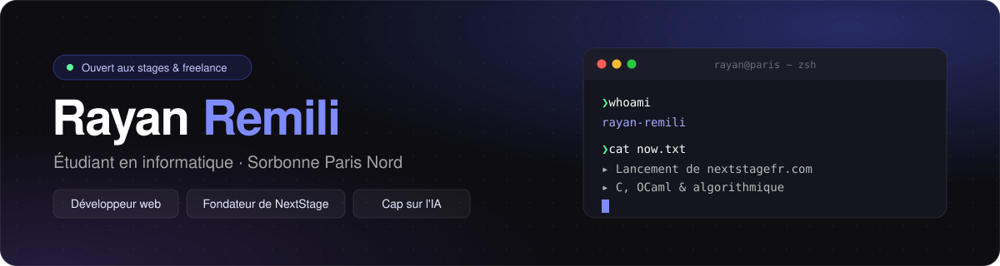
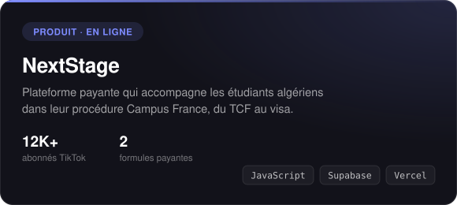
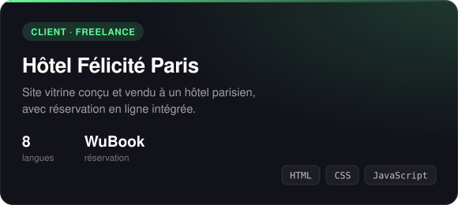
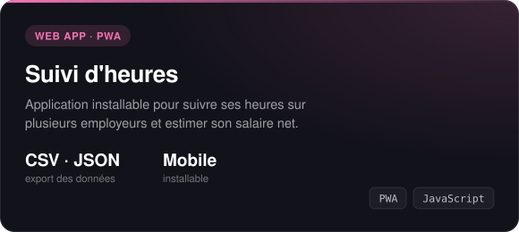
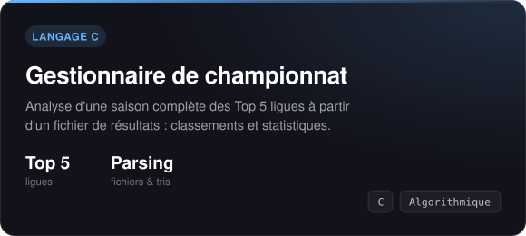

  
  
  
  

 

## À propos

Étudiant en **Licence Informatique** à l'Institut Galilée (Sorbonne Paris Nord), après une prépa à l'ESTIN et un bac maths obtenu avec **17,85/20**.

En parallèle de mes études, je construis des produits web utilisés par de vrais clients. Je développe notamment **[NextStage](https://nextstagefr.com)**, une plateforme payante d'accompagnement Campus France, et je réalise des sites en freelance.

- **En ce moment :** lancement de NextStage, programmation en C et OCaml, algorithmique
- **Objectif :** m'orienter vers l'ingénierie IA et data
- **Ouvert à :** stage, alternance, missions freelance
- **Langues :** français (C1), anglais, kabyle, arabe

 

## Projets

  
  

  
  

<a href="https://rayan-remili.vercel.app">Voir tous mes projets sur mon portfolio →</a>

 

## Stack

<table>
  <tr>
    <td><b>Web</b></td>
    <td></td>
  </tr>
  <tr>
    <td><b>Programmation</b></td>
    <td></td>
  </tr>
  <tr>
    <td><b>Outils</b></td>
    <td></td>
  </tr>
</table>

 

  Un projet, un stage ou une question ? <a href="mailto:rmrayan04@gmail.com">rmrayan04@gmail.com</a>

